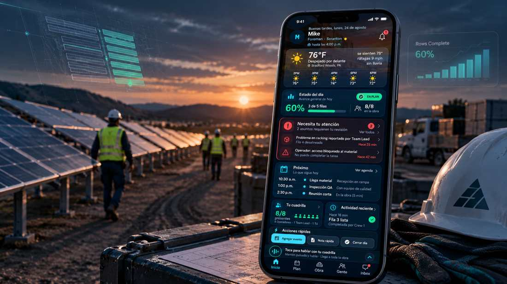

# Michael Romero

**Software Developer · Applied AI & Automation**

Building practical systems for real-world operations, automation, and decision support.

Focused on product engineering, AI-assisted workflows, and software that turns complex processes into simple, usable tools.

Houston, TX &nbsp; · &nbsp; Open to Software / Automation opportunities

 

## Selected Work

### Cluster Ops
**Field Operations Platform**

**Run the field from one place.**

From morning check-in to final report, Cluster Ops brings crews, schedules, progress, materials, communication, weather, site activity, documentation, and reporting into one connected operational system.

CREW OPERATIONS &nbsp; · &nbsp; SCHEDULING &nbsp; · &nbsp; SITE INTELLIGENCE &nbsp; · &nbsp; MATERIALS &nbsp; · &nbsp; REPORTING

 

### Additional Work

<table>
  <tr>
    <td width="33%" valign="top">
        
      <strong>ORBIT</strong> 
      AI-Assisted Workflow Automation  
      Human-in-the-loop workflows for research, personalization, outreach, and controlled task execution.
    </td>
    <td width="33%" valign="top">
        
      <strong>REDLINE</strong> 
      Market Decision System  
      Desktop software for market context, decision tracking, trade review, and execution discipline.
    </td>
    <td width="33%" valign="top">
        
      <strong>AtomX</strong> 
      Personal Finance Workspace  
      A unified workspace for cash flow, recurring obligations, transaction visibility, and financial goals.
    </td>
  </tr>
</table>

## Engineering Focus

Applied AI · Workflow Automation · Python · APIs 
Desktop Applications · Linux · Data Workflows · Product Engineering
